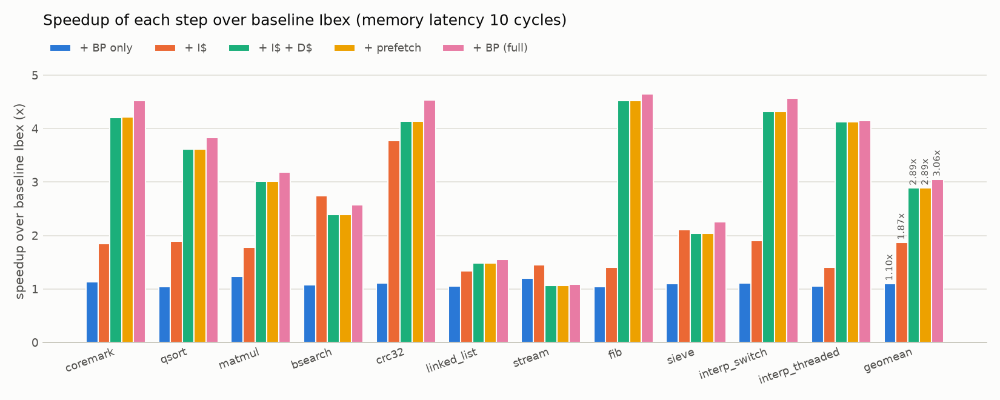
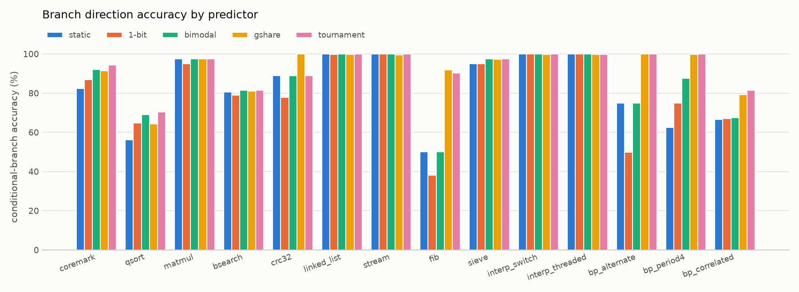
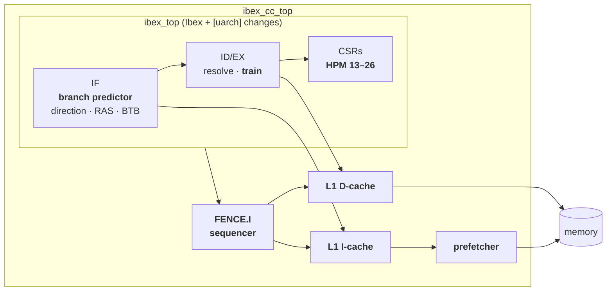

# Branch prediction, L1 caches and performance counters for the Ibex RISC-V core

This project extends [lowRISC Ibex](https://github.com/lowRISC/ibex), a small 2-stage RV32IMC core,
with the micro-architecture it leaves out: a **dynamic branch predictor**, **L1 instruction and
data caches**, and **hardware performance counters** to measure both. The verification
environment is adapted from OpenHW's **CV32E40P** testbench, and the performance impact is
measured on real workloads using the core's own counters.

On a system with 10-cycle main memory, the extended core runs the benchmark suite **3.06× faster**
than stock Ibex (geomean IPC 0.150 → 0.457). The full regression of 776 simulations passes with
every checker and assertion enabled.



## What's here

| | |
|---|---|
| **Branch prediction** ([docs](docs/branch_prediction.md)) | Five selectable direction predictors (static BTFN, 1-bit, bimodal, gshare, tournament), an 8-entry return address stack and a 16-entry indirect-jump BTB, all in the IF stage. Prediction metadata travels down the pipeline so the entry that predicted is the entry that trains, and mispredictions are repaired through Ibex's existing flush paths. |
| **L1 caches** ([docs](docs/caches.md)) | One parameterised set-associative cache used twice: a read-only I-cache and a write-back (or write-through) D-cache, with 1-cycle hits, PLRU/FIFO/random replacement, dirty-line eviction, uncached MMIO bypass, a next-line I-cache prefetcher, and a FENCE.I sequence that keeps self-modifying code coherent. |
| **Performance counters** ([docs](docs/performance_counters.md)) | 14 new events on the standard `mhpmcounter` CSRs: direction mispredicts, RAS/BTB hits and wrong targets, cache accesses, misses, write-backs, prefetch hits. |
| **Verification** ([docs](docs/verification.md)) | CV32E40P example testbench adapted for Ibex: an RVFI control-flow checker, a pipeline-redirect checker, an end-to-end memory scoreboard, bus protocol checkers, 32 SVA properties in the RTL, 100 functional-coverage bins, constrained-random block-level benches, and an automated parallel regression. |
| **Evaluation** ([docs](docs/evaluation.md)) | 11 studies (feature ladder, predictor type and size, RAS/BTB, prefetching, write policy, cache size, associativity, line size, replacement, memory latency) over CoreMark and 10 kernels, reported as CPI, IPC, branch accuracy, MPKI and miss rates. |

All new RTL is in [`rtl/`](rtl/) (about 2,300 lines of SystemVerilog). Upstream Ibex is changed
in only 8 files (231 added lines, each tagged `[uarch]`). With every feature disabled, the core
is cycle-identical to upstream.

## Results

Geomean over 11 workloads, 10-cycle memory, 2 KiB 2-way caches with 16 B lines
([full tables](results/evaluation.md), [analysis](docs/evaluation.md)):

| Configuration | CPI | IPC | Speedup |
|---|---|---|---|
| Baseline Ibex | 6.69 | 0.150 | 1.00× |
| + branch prediction only | 6.05 | 0.165 | 1.10× |
| + I-cache | 3.57 | 0.280 | 1.87× |
| + I-cache + D-cache | 2.31 | 0.433 | 2.89× |
| + prefetcher | 2.31 | 0.433 | 2.89× |
| + branch prediction (full) | **2.19** | **0.457** | **3.06×** |

A few findings that were not obvious before measuring:

* **Memory latency, not branches, limits Ibex.** Baseline Ibex spends 47% of its cycles waiting
  for instruction fetch and 36% waiting for data. The caches are worth 2.89×. Branch prediction
  is worth 1.10× on its own and another 5.5% on top of the caches. Stock Ibex's CPI grows by
  0.58 per cycle of memory latency; the full core's grows by 0.036.
* **Better predictors barely change CPI on a 2-stage pipeline.** Going from static to tournament
  prediction raises mean accuracy from 86.4% to 92.7% and cuts mispredictions from 23.7 to 14.8
  per 1000 instructions. But with an I-cache each avoided mispredict saves only about 1.1 cycles,
  so CPI improves by 0.6%. Most of the gain comes from predicting taken branches *at all*.
  Correct return predictions save nothing at all when the target hits in the I-cache: Ibex's
  2-cycle jumps already hide the redirect.
* **A cache can make things slower.** `stream` runs 37% slower with the 2-way D-cache than
  without: its three arrays map to the same sets and thrash two ways (70% miss rate). At 4 ways
  the miss rate falls to the ideal 25% and `stream` runs 2.6× faster. `bsearch` (83% misses) is
  below the 40% hit rate at which a cache breaks even with this memory. With 1-cycle memory the
  caches cost 12%.
* **History timing matters.** On `crc32` gshare is perfect while the tournament predictor is stuck
  at 88.9%. The history is updated when a branch resolves, so the index a branch sees depends on
  whether the branch before it was mispredicted. The tournament predictor settles into the state
  where two branches collide in the gshare table.



## Architecture



Details: [docs/architecture.md](docs/architecture.md).

## Verification

A test passes only if the program reports success **and** none of these fired:

* `rvfi_pc_checker` recomputes the correct next PC of every retired instruction, so any
  unrepaired misprediction is caught.
* `redirect_checker` checks that every pipeline flush resumes at the right instruction.
* `mem_scoreboard` compares every load and instruction fetch against a reference memory, so the
  caches must be invisible.
* `obi_checker` checks the bus protocol on both sides of both caches.
* 32 SVA properties inside the RTL.

The latest full regression runs **776 simulations: all pass**. That is 735 system-level runs over
10 configurations (ISA tests, directed tests, all benchmarks, and stress runs with random bus
stalls) plus 41 constrained-random block-level runs over 14 cache and predictor configurations.
All **100/100 functional-coverage bins** are hit.

Details: [docs/verification.md](docs/verification.md).

## Quick start

Needs Verilator ≥ 5.020, a bare-metal RISC-V GCC, make and Python 3. It runs on Linux, WSL2 or
natively on Windows with MSYS2 ([setup guide](docs/getting_started.md)).

```bash
make run TEST=hello             # build the full configuration and run a test
make run TEST=coremark CONFIG=baseline
make smoke                      # 5 directed tests, ~1 minute
make regress                    # full regression -> build/regress/report.md
make eval                       # performance study -> results/, docs/figures/
```

## Repository layout

```
rtl/            new RTL: predictor, caches, prefetcher, core complex
ibex/           upstream Ibex (rtl/ carries the tagged integration changes)
cv32e40p/       upstream CV32E40P (source of the adapted testbench)
dv/             testbench, checkers, coverage, block-level benches
sim/            Verilator build, run and lint flow
sw/             runtime, directed tests, benchmarks, riscv-tests
scripts/        regression and evaluation
results/        evaluation data (CSV) and generated tables
docs/           design notes, verification, evaluation, figures
```

## Design decisions worth calling out

* **Predictions are hints, never state.** The predictor only steers fetch. Every prediction is
  checked in ID/EX and repaired through Ibex's existing paths, with one new controller term for a
  wrong JALR target. A predictor bug can cost cycles but cannot corrupt architectural state, and
  the RVFI checker verifies exactly that.
* **Train with the indices that predicted.** Table indices travel with the instruction, so
  training is exact even though the global history has moved on. Tables update only at
  resolution, so wrong-path instructions never pollute them and no repair logic is needed.
* **Update the RAS when a call enters ID, not when it executes.** No wrong-path instruction ever
  enters ID in Ibex, so this is safe. It also covers a function whose first instruction is `ret`,
  which is fetched before its call has executed.
* **Caches speak the core's bus protocol on both sides.** They drop in between `ibex_top` and
  memory without touching the fetch or load/store units, and the same module serves as I- and
  D-cache.
* **FENCE.I is a cache-maintenance sequence.** Hold fetch, clean the D-cache, invalidate the
  I-cache and prefetch buffer, then release. It is the minimum RISC-V requires for self-modifying
  code with split caches.

## Limitations and next steps

* Caches are blocking, with no hit-under-miss or critical-word-first. That is the largest
  remaining cost for `linked_list`, `stream` and `sieve`.
* The prefetcher helps only when the I-cache is too small for the working set. A stride
  prefetcher on the D-side would matter more for these workloads.
* The global history is updated at resolution, which avoids repair logic but makes gshare's
  indices timing-dependent (the `crc32` effect above). A speculative history with checkpointed
  repair is the natural next step.
* Tables are flop arrays read combinationally in IF. For a real clock target they would move to
  SRAM, and the prediction path would need pipelining. The design was not synthesised.
* CoreMark is used as a workload (2 iterations), not as a compliant CoreMark score.

## Acknowledgements and licensing

Built on [lowRISC Ibex](https://github.com/lowRISC/ibex) (Apache-2.0) and the
[OpenHW CV32E40P](https://github.com/openhwgroup/cv32e40p) example testbench (Solderpad 0.51).
It uses [riscv-tests](https://github.com/riscv-software-src/riscv-tests) (BSD) and
[EEMBC CoreMark](https://github.com/eembc/coremark). New code is Apache-2.0 ([LICENSE](LICENSE)).
Files adapted from CV32E40P keep the Solderpad header.
