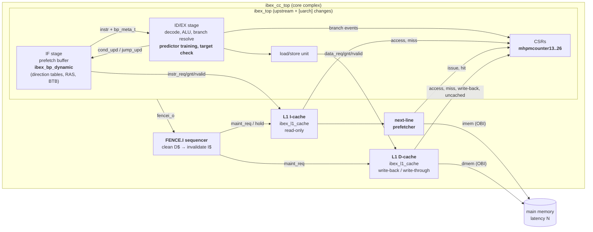

# Architecture

This project extends the [lowRISC Ibex](https://github.com/lowRISC/ibex) RV32IMC core, a 2-stage
in-order pipeline, with three micro-architectural features, and wraps the result in a *core
complex*:

1. **Branch prediction** in the IF stage: a configurable direction predictor (static, 1-bit,
   bimodal, gshare, tournament), a return address stack and an indirect-jump BTB. It replaces Ibex's
   experimental static predictor → [branch_prediction.md](branch_prediction.md)
2. **L1 instruction and data caches**: parameterised and set-associative, with a write-back (or
   write-through) D-cache, a next-line I-cache prefetcher and FENCE.I coherence →
   [caches.md](caches.md)
3. **Extended hardware performance counters**: 14 new branch-prediction and cache events in the
   standard `mhpmcounter` CSRs → [performance_counters.md](performance_counters.md)

## Block diagram



Bold boxes are new modules or new functionality; everything else is upstream Ibex.

## Design principles

* **Minimal, tagged changes to upstream.** New logic lives in new modules under `rtl/`. Upstream
  files are touched only where the pipeline has to be integrated: 231 added lines in 8 files, every
  change marked `[uarch]`. `git diff 9ad7cc8 -- ibex/rtl` shows all of them. With the predictor
  and caches disabled, the core complex is cycle-identical to upstream Ibex.
* **Reuse the existing correctness mechanisms.** The predictor only *steers* fetch. Resolution and
  recovery use Ibex's own branch unit and `nt_branch_mispredict` path, plus one new term in the
  controller for a wrong indirect-jump target. A predictor bug can cost performance but cannot
  corrupt architectural state.
* **Caches sit on standard interfaces.** Both caches speak the Ibex/OBI request-grant /
  response-valid protocol on both sides and sit between `ibex_top` and memory, so the core's fetch
  and load/store units are unchanged.
* **Everything is a parameter.** Predictor type and table sizes, cache geometry, replacement and
  write policy, prefetcher and the cacheable address range are all elaboration-time parameters.
  One RTL code base produces every configuration in the evaluation.

## Source files

### New RTL (`rtl/`)

| File | Lines | Contents |
|---|---|---|
| `ibex_uarch_pkg.sv` | 132 | predictor and replacement enums, prediction metadata and training structs, HPM event map |
| `ibex_bp_dynamic.sv` | 467 | branch predictor: pre-decode, direction tables, GHR, RAS, BTB, training, SVA |
| `cache/ibex_l1_repl.sv` | 180 | replacement: tree-PLRU, FIFO, LFSR-random, invalid-first |
| `cache/ibex_l1_cache.sv` | 608 | set-associative cache: lookup, refill, eviction, write-through, bypass, maintenance, SVA |
| `cache/ibex_l1_prefetch.sv` | 314 | next-line instruction prefetcher (one-line stream buffer) |
| `ibex_cc_top.sv` | 539 | core complex: `ibex_top` + I$ + prefetcher + D$ + FENCE.I sequencer + HPM routing |
| `include/uarch_assert.svh` | 40 | assertion/cover macros that Verilator evaluates |
| `rtl_files.f` | – | file list (upstream + new) |

### Modified upstream Ibex files (`ibex/rtl/`, all changes tagged `[uarch]`)

| File | Change |
|---|---|
| `ibex_if_stage.sv` | instantiate `ibex_bp_dynamic` in place of the static predictor; carry `bp_meta_t` through the skid buffer and IF/ID register; accept training updates |
| `ibex_id_stage.sv` | one training event per resolved conditional branch and per JAL/JALR; check predicted JALR targets; generate the six branch HPM events |
| `ibex_controller.sv` | redirect fetch when a predicted JALR target is wrong (`jump_mispredict_i`) |
| `ibex_cs_registers.sv` | HPM events 13–26 |
| `ibex_core.sv` | wire the predictor metadata IF↔ID, export `fencei_o`, accept `hpm_ext_event_i` |
| `ibex_top.sv`, `ibex_lockstep.sv` | pass the new parameters and ports through (the lockstep shadow core receives the same delayed events) |
| `ibex_top_tracing.sv` | tie off the new ports |

## Configuration parameters (`ibex_cc_top`)

| Parameter | Default | Meaning |
|---|---|---|
| `BpMode` | `BpGshare` | `BpNone`, `BpStatic` (BTFN), `BpOneBit`, `BpBimodal`, `BpGshare`, `BpTournament` |
| `BpPhtEntries` | 512 | direction-table entries (power of two, ≤ 4096) |
| `BpGhrBits` | 8 | global history length for gshare/tournament (≤ log2 of the table size) |
| `BpRasDepth` | 8 | return address stack entries (power of two, 0 = off) |
| `BpBtbEntries` | 16 | indirect-jump BTB entries (power of two, 0 = off) |
| `ICacheEn` / `DCacheEn` | 1 / 1 | instantiate the cache (0 = wire-through) |
| `{I,D}CacheSets` | 64 | sets (power of two) |
| `{I,D}CacheWays` | 2 | ways (power of two) |
| `{I,D}CacheLineBytes` | 16 | line size in bytes (power of two, ≥ 8) |
| `{I,D}CacheRepl` | `ReplPlru` | `ReplPlru`, `ReplFifo`, `ReplRandom` |
| `ICachePrefetch` | 1 | next-line prefetcher behind the I-cache |
| `DCacheWriteThrough` | 0 | 0 = write-back/write-allocate, 1 = write-through/no-allocate |
| `CacheableMask/Base` | `F000_0000`/`0` | addresses with `(addr & Mask) == Base` are cached; others bypass (MMIO) |

The testbench (`dv/tb/tb_top.sv`) exposes the same knobs as integer parameters (`BP_MODE`,
`IC_SETS`, `DC_WT`, ...), and its default is the `full` configuration: tournament predictor,
RAS, BTB, prefetcher and write-back D-cache.

The core itself uses the Ibex "small" configuration: RV32IMC, fast multi-cycle multiplier, no
branch-target ALU, 2-stage pipeline, flip-flop register file, no PMP.

## Memory map (testbench SoC)

| Address | Region | Cached |
|---|---|---|
| `0x0000_0000`–`0x000F_FFFF` | 1 MiB RAM: vectors at 0, reset entry at `0x80`, stack at the top | yes |
| `0x1000_0000` | putchar | no |
| `0x1500_0000`, `0x1500_0004` | timer interrupt enable / count | no |
| `0x2000_0000`–`0x2000_0010` | test status, exit code, signature | no |
| `0x2000_0100` | read-only configuration word (predictor, RAS/BTB, caches, prefetcher, write policy) | no |
| anything else | bus error | – |

The memory map follows the CV32E40P example testbench (see [verification.md](verification.md)).

## Fetch, load and store paths

* **Instruction fetch.** The prefetch buffer requests word-aligned addresses. The I-cache answers a
  hit one cycle after the grant and can accept the next request in that same cycle (1 fetch per
  cycle). On a miss it fetches the line (`LineWords` pipelined reads, served from the prefetch
  buffer if the prefetcher already has it), installs it and replays. Wrong-path fetches after a
  redirect still receive responses (OBI requires it), and the prefetch buffer discards them.
* **Branch prediction.** When the instruction at the head of the prefetch buffer is a direct jump,
  a conditional branch predicted taken, a return with a RAS entry, or an indirect jump that hits in
  the BTB, IF redirects fetch to the predicted target immediately. ID/EX resolves the instruction,
  trains the predictor and repairs any misprediction ([branch_prediction.md](branch_prediction.md)).
* **Loads and stores.** Ibex issues at most one data transaction at a time (two for a misaligned
  access, which may straddle cache lines). In write-back mode, store hits set the dirty bit and
  misses allocate, evicting and writing back a dirty victim first. In write-through mode every store
  also goes to memory and misses do not allocate.
* **FENCE.I.** Ibex executes FENCE.I as a jump to the next PC and pulses `fencei_o`. The sequencer
  holds instruction fetch, cleans the D-cache (writes back all dirty lines), invalidates the I-cache
  and the prefetch buffer, and releases fetch. Self-modifying code therefore observes its own
  stores ([caches.md § FENCE.I](caches.md#fencei-coherence)).

## Repository layout

```
rtl/                 new RTL (predictor, caches, prefetcher, core complex)
ibex/                upstream lowRISC Ibex (rtl/ carries the [uarch] integration changes)
cv32e40p/            upstream OpenHW CV32E40P (source of the adapted testbench)
dv/
  tb/                system testbench (adapted from the CV32E40P example_tb)
  checkers/          RVFI control-flow checker, redirect checker, memory scoreboard, OBI checker
  coverage/          functional coverage models
  unit/              block-level cache and predictor testbenches
sim/                 Verilator build / run / lint flow, lint waivers
sw/
  common/            crt0, linker script, printf/runtime, HPM helpers (perf.h)
  tests/             directed tests (branch torture, calls/returns, FENCE.I, cache stress, traps, IRQ, HPM)
  bench/             workloads (CoreMark + 10 kernels)
  riscv-tests/       vendored rv32ui/um/uc ISA tests + ported environment
scripts/             regression, evaluation, tool installer
results/             evaluation data (CSV) and generated tables
docs/                documentation and figures
```
