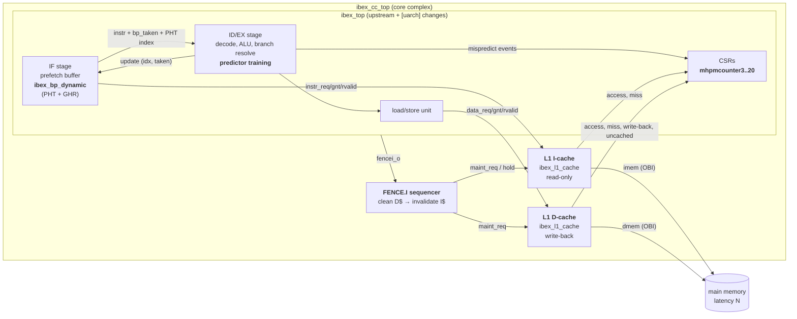

# Architecture

This project extends the [lowRISC Ibex](https://github.com/lowRISC/ibex) RV32IMC core, a 2-stage
in-order pipeline, with three micro-architectural features and wraps it in a *core complex*:

1. **Dynamic branch prediction** in the IF stage (bimodal or gshare), replacing Ibex's experimental
   static predictor → [branch_prediction.md](branch_prediction.md)
2. **L1 instruction and data caches**, parameterised, set-associative, write-back D-cache with
   FENCE.I coherence → [caches.md](caches.md)
3. **Extended hardware performance counters**: branch-mispredict and cache events in the standard
   `mhpmcounter` CSRs → [performance_counters.md](performance_counters.md)

## Block diagram



Bold boxes are new modules or new functionality; everything else is upstream Ibex.

## Design principles

* **Minimal, tagged changes to upstream.** New logic lives in new modules under `rtl/`. The
  upstream files are touched only where the pipeline must be integrated (173 added lines in 7 files,
  every change marked `[uarch]`). A configuration with the predictor and caches disabled is
  cycle-identical to upstream Ibex.
* **Reuse the existing correctness mechanisms.** The predictor only *steers* fetch. Resolution and
  recovery use Ibex's existing branch unit and `nt_branch_mispredict` path, so a predictor bug can
  only cost performance, never correctness.
* **Caches sit on standard interfaces.** Both caches speak the Ibex/OBI request-grant /
  response-valid protocol on both sides and are inserted between `ibex_top` and memory, so the core's
  fetch and load/store units are unchanged.
* **Everything is a parameter.** Predictor type and table sizes, cache geometry, replacement policy
  and the cacheable address range are elaboration-time parameters, so one RTL code base produces
  every configuration in the evaluation.

## Source files

### New RTL (`rtl/`)

| File | Lines | Contents |
|---|---|---|
| `ibex_uarch_pkg.sv` | 87 | predictor/replacement enums, PHT index width, HPM event map |
| `ibex_bp_dynamic.sv` | 230 | branch predictor: target decode, PHT, GHR, update logic, SVA |
| `cache/ibex_l1_repl.sv` | 180 | replacement policy: tree-PLRU, FIFO, LFSR-random, invalid-first |
| `cache/ibex_l1_cache.sv` | 594 | set-associative cache: lookup, refill, eviction, bypass, maintenance, SVA |
| `ibex_cc_top.sv` | 483 | core complex: `ibex_top` + I$ + D$ + FENCE.I sequencer + HPM routing |
| `include/uarch_assert.svh` | 40 | assertion/cover macros evaluated by Verilator |
| `rtl_files.f` | – | file list (upstream + new) |

### Modified upstream Ibex files (`ibex/rtl/`, all changes tagged `[uarch]`)

| File | Change |
|---|---|
| `ibex_if_stage.sv` | instantiate `ibex_bp_dynamic` instead of the static predictor; carry the PHT index through the skid buffer and IF/ID register; accept training updates |
| `ibex_id_stage.sv` | generate one training event per resolved conditional branch; direction-mispredict perf events |
| `ibex_cs_registers.sv` | new HPM events 13–20 (mispredicts and 6 external cache events) |
| `ibex_core.sv` | wire the predictor metadata IF↔ID, expose `fencei_o`, accept `hpm_ext_event_i` |
| `ibex_top.sv`, `ibex_lockstep.sv` | pass the new parameters and ports through (the lockstep shadow core receives the same delayed events) |
| `ibex_top_tracing.sv` | tie off the new ports |

`git diff 9ad7cc8 -- ibex/rtl` shows the complete change against the upstream clone.

## Configuration parameters (`ibex_cc_top`)

| Parameter | Default | Meaning |
|---|---|---|
| `BpMode` | `BpGshare` | `BpNone`, `BpStatic` (BTFN), `BpBimodal`, `BpGshare` |
| `BpPhtEntries` | 512 | pattern history table entries (power of two, ≤ 4096) |
| `BpGhrBits` | 8 | global history length for gshare (≤ log2 of the PHT size) |
| `ICacheEn` / `DCacheEn` | 1 / 1 | instantiate the cache (0 = wire-through) |
| `{I,D}CacheSets` | 64 | sets (power of two) |
| `{I,D}CacheWays` | 2 | ways (power of two) |
| `{I,D}CacheLineBytes` | 16 | line size in bytes (power of two, ≥ 8) |
| `{I,D}CacheRepl` | `ReplPlru` | `ReplPlru`, `ReplFifo`, `ReplRandom` |
| `CacheableMask/Base` | `F000_0000`/`0` | addresses with `(addr & Mask) == Base` are cached; others bypass (MMIO) |

The core itself uses the Ibex "small" configuration: RV32IMC, fast multi-cycle multiplier,
no branch-target ALU, 2-stage pipeline, flip-flop register file, no PMP.

## Memory map (testbench SoC)

| Address | Region | Cached |
|---|---|---|
| `0x0000_0000`–`0x000F_FFFF` | 1 MiB RAM: vectors at 0, reset entry at `0x80`, stack at the top | yes |
| `0x1000_0000` | putchar | no |
| `0x1500_0000`, `0x1500_0004` | timer interrupt enable / count | no |
| `0x2000_0000`–`0x2000_0010` | test status, exit code, signature | no |
| `0x2000_0100` | read-only configuration word (predictor, cache enables) | no |
| anything else | bus error | – |

The memory map follows the CV32E40P example testbench (see [verification.md](verification.md)).

## Fetch, load and store paths

* **Instruction fetch.** The prefetch buffer requests word-aligned addresses. The I-cache answers a
  hit one cycle after the grant and can accept the next request in that same cycle (1 fetch/cycle).
  On a miss it fetches the line (`LineWords` pipelined reads), installs it and replays.
  Wrong-path fetches after a redirect still receive responses (OBI requires it) and are
  discarded by the prefetch buffer.
* **Branch prediction.** When the instruction at the head of the prefetch buffer is a JAL/C.J or
  a conditional branch predicted taken, IF redirects fetch to its target immediately. The branch
  resolves in ID/EX and trains the predictor; a wrong "taken" prediction is repaired by the existing
  `nt_branch_mispredict` path, a wrong "not-taken" prediction by the normal taken-branch path.
* **Loads and stores.** Ibex issues at most one data transaction at a time (two for a misaligned
  access, which may straddle cache lines). Stores hit in the D-cache and set the dirty bit; misses
  allocate (write-allocate), evicting and writing back a dirty victim first.
* **FENCE.I.** Ibex executes FENCE.I as a jump to the next PC and pulses `fencei_o`. The sequencer
  holds instruction fetch, cleans the D-cache (writes back all dirty lines), invalidates the I-cache
  and releases fetch, so self-modifying code observes its own stores
  ([caches.md § FENCE.I](caches.md#fencei-coherence)).

## Repository layout

```
rtl/                 new RTL (predictor, caches, core complex)
ibex/                upstream lowRISC Ibex (rtl/ carries the [uarch] integration changes)
cv32e40p/            upstream OpenHW CV32E40P (source of the adapted testbench)
dv/
  tb/                system testbench (adapted from CV32E40P example_tb)
  checkers/          RVFI control-flow checker, memory scoreboard, OBI protocol checker
  coverage/          functional coverage models
  unit/              block-level cache and predictor testbenches
sim/Makefile         Verilator build / run / lint flow
sw/
  common/            crt0, linker script, printf/runtime, HPM helpers (perf.h)
  tests/             directed tests (branch torture, FENCE.I, cache stress, traps, IRQ, HPM)
  bench/             workloads (CoreMark + 9 kernels)
  riscv-tests/       vendored rv32ui/um/uc ISA tests + ported environment
scripts/             regression, evaluation, tool installer
results/             evaluation data (CSV) and generated tables
docs/                documentation and figures
```
