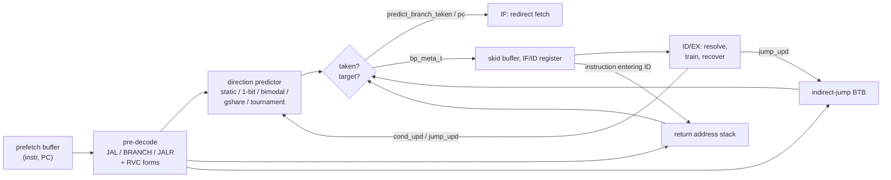

# Branch prediction

`rtl/ibex_bp_dynamic.sv` replaces Ibex's experimental static predictor (`ibex_branch_predict`). It
predicts the direction of conditional branches with a configurable direction predictor, and the
target of register-indirect jumps with a return address stack (RAS) and an indirect-jump branch
target buffer (BTB).

## Why Ibex benefits

Ibex is a two-stage pipeline (IF, then a combined ID/EX). Without prediction, fetch simply
continues at PC + 2/4, and a control transfer is only discovered when it reaches ID/EX:

| Instruction | Upstream Ibex cost (from `ibex/doc/03_reference/pipeline_details.rst`) |
|---|---|
| branch, not taken | no stall |
| branch, taken | 2 stall cycles (condition, then target, both on the ALU), then refetch |
| JAL / JALR | at least 1 stall cycle to flush the prefetch buffer, then refetch |

Every refetch also pays the instruction-memory latency, so on a system with slow instruction memory
a taken branch costs far more than the two cycles in the table. The predictor recognises control
transfers one stage earlier, at the output of the prefetch buffer. It redirects fetch in IF before
the instruction reaches ID/EX, so a correctly predicted taken branch or jump does not wait for
ID/EX at all.

## Organisation

### Pre-decode and direct targets

The predictor decodes the instruction presented by the prefetch buffer: `JAL`, `BRANCH`, `JALR`
and the compressed forms `C.J`, `C.JAL`, `C.BEQZ`, `C.BNEZ`, `C.JR` and `C.JALR`. For direct
branches and jumps the target is `PC + immediate`, so no BTB entry is needed.
**Unconditional direct jumps are always predicted taken** and are therefore never mispredicted.

### Direction predictors (`BpMode`)

| Mode | Organisation | Learns |
|---|---|---|
| `BpNone` | no predictor: fetch continues at PC + 2/4 (upstream default) | – |
| `BpStatic` | BTFN: backward taken, forward not taken (upstream `ibex_branch_predict`) | loop back-edges |
| `BpOneBit` | PC-indexed table, 1 bit per entry: repeat the last outcome | stable branches |
| `BpBimodal` | PC-indexed table of 2-bit saturating counters | biased branches, tolerates one anomaly |
| `BpGshare` | 2-bit counters indexed by `PC ⊕ global history` | correlated and periodic patterns |
| `BpTournament` | bimodal + gshare + per-PC 2-bit chooser | the better of the two, per branch |

* Tables have `BpPhtEntries` entries (power of two, up to 4096). They are indexed with
  `PC[log2(N):1]`. Bit 0 is dropped rather than bit 1 because compressed instructions are
  halfword aligned.
* The global history register (GHR) holds the last `BpGhrBits` outcomes. gshare XORs it into the
  low index bits.
* The tournament chooser moves towards whichever component was right, and only when the two
  disagree. It resets to "weakly prefer bimodal" because bimodal warms up faster.
* The static predictor with the RAS and BTB disabled reproduces upstream Ibex exactly.

### Return address stack (`BpRasDepth`)

RISC-V has no dedicated call/return instructions. The ISA manual defines *hints* instead: a
`JAL`/`JALR` whose `rd` is a link register (`x1`/`ra` or `x5`/`t0`) is a call (push). A `JALR`
whose `rs1` is a link register is a return (pop). A `JALR` that does both with *different* link
registers is a co-routine swap (pop, then push). The RAS implements that table.

* A circular stack of `BpRasDepth` return addresses (default 8). Overflow overwrites the oldest
  entry. A return deeper than the stack then either finds no prediction or finds a wrong one; the
  wrong one is caught and repaired in ID/EX like any other misprediction.
* The RAS is updated when a call or return **enters ID**, not when it executes. In Ibex no
  wrong-path instruction ever enters ID, because a redirect blocks the IF/ID register write. So
  this is as safe as updating at execution, and it has one important advantage: a return fetched
  right behind its call already sees the pushed address. That case happens whenever a function's
  first instruction is `ret`. `sw/tests/hpm_counters` checks it explicitly.

### Indirect-jump BTB (`BpBtbEntries`)

JALRs that are not returns (function pointers, `switch` jump tables, interpreter dispatch) use a
direct-mapped, tagged BTB holding the last target of each jump (default 16 entries). It is
indexed by `PC[log2(N):1]` with the remaining PC bits as the tag, so two jumps that alias to one
entry never produce a false hit. Without a RAS, returns are cached in the BTB like any other
indirect jump.

## Training and recovery

Each prediction produces a `bp_meta_t` record: the table indices used, both tournament component
predictions, the predicted target and whether it came from the RAS or BTB. The record travels with
the instruction through the skid buffer and the IF/ID register (60 bits). When the instruction
resolves in ID/EX:

* **Conditional branch** → `cond_upd`: the entries named by the carried indices are trained, and
  the GHR shifts in the outcome. Training uses the *carried* indices, so the entry that made the
  prediction is the one that learns, even if the GHR has moved on since. Tables and GHR are only
  updated at resolution, so wrong-path instructions never touch them and no repair logic is needed.
* **JAL/JALR** → `jump_upd`: the BTB learns the target of each non-return indirect jump.

A prediction is only a hint. ID/EX verifies every one, and the controller repairs a wrong one with
Ibex's existing mechanisms:

| Misprediction | Recovery |
|---|---|
| branch predicted taken, actually not taken | `nt_branch_mispredict`: refetch at PC + 2/4 (upstream path) |
| branch predicted not taken, actually taken | normal taken-branch redirect (upstream path) |
| JALR predicted to the wrong target | new `jump_mispredict` input to the controller: redirect to the computed target |

The last row is the only change to the controller: one term in the `pc_set` condition. Because the
predictor only steers fetch, a bug in it can cost performance but cannot corrupt architectural
state. The verification environment still checks this directly (below).

## Storage cost (default `full` configuration)

| Structure | Size | Bits |
|---|---|---|
| bimodal counters | 512 × 2 b | 1024 |
| gshare counters | 512 × 2 b | 1024 |
| chooser counters | 512 × 2 b | 1024 |
| global history | 8 b | 8 |
| RAS | 8 × 32 b + pointers | 263 |
| BTB | 16 × (valid + 27 b tag + 31 b target) | 944 |
| pipeline metadata | 60 b in skid buffer + 60 b in IF/ID | 120 |
| **total** | | **≈ 4.4 kbit (≈ 550 B)** |

Tables are flop arrays with an asynchronous read. The lookup is combinational from the
prefetch-buffer output to the fetch-address mux. That path is the most likely critical path if you
synthesised this, and the first thing to pipeline for a higher clock.

## Assertions (in `ibex_bp_dynamic.sv`)

| Assertion | Property |
|---|---|
| `BpCounterUpdateRule` | one cycle after training, the entry holds exactly the saturating-counter (or 1-bit) successor of its old value |
| `BpUpdateIdxInRange` | training indices always come from a lookup of this table |
| `BpInstrTypeOneHot` | pre-decode recognises at most one control-transfer type |
| `BpTargetAligned` | a taken prediction always has a known, halfword-aligned target |
| `BpIndirectSingleSource` | a JALR is predicted by the RAS or the BTB, never both |
| `RasTopAfterPush`, `RasCountInRange` | after a call the top of the stack is its return address; occupancy is bounded |
| `CallRetDecodeConsistent` | the IF pre-decoder (raw, possibly compressed) and ID/EX (decompressed) classify every call/return identically |

## Verification

* **Block level** (`dv/unit/tb_bp.sv`): 20 000 random instructions against a reference decoder;
  synthetic branch streams (always, alternating, period-4, random) with per-predictor accuracy
  bounds, e.g. gshare and tournament must learn the alternating pattern perfectly; random nested
  call/return sequences three times deeper than the RAS, checked against a software shadow stack;
  and BTB aliasing. Runs for every mode and a deliberately tiny configuration.
* **System level**: `rvfi_pc_checker` recomputes the architecturally correct next PC of every
  retired instruction from its encoding and operands. It would catch any unrepaired
  misprediction. `redirect_checker` checks, one stage earlier, that after every redirect the next
  instruction entering ID is the one at the redirect target. Directed tests `branch_torture`
  (assembly corner cases around the skid buffer and back-to-back branches) and `call_return`
  (RAS overflow, x5 links, co-routine swaps, changing function-pointer targets) target the
  predictor specifically.

See [verification.md](verification.md) for the full environment and [evaluation.md](evaluation.md)
for measured accuracy and speedup.

## Limitations and possible extensions

* The GHR is updated at resolution rather than speculatively at prediction. With a two-stage
  pipeline at most one branch is unresolved at a time, so the history lags by at most one branch.
  A deeper pipeline would need speculative history with repair.
* Tables are not partially tagged, so aliasing between branches is unfiltered. A TAGE-style
  predictor is the natural next step for accuracy, at a large cost in area for a core this size.
