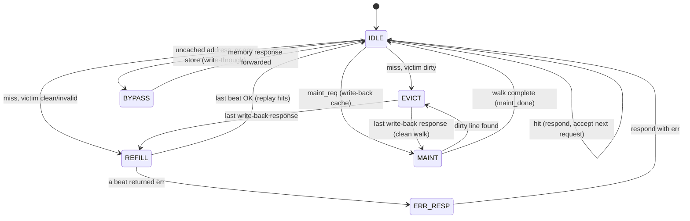
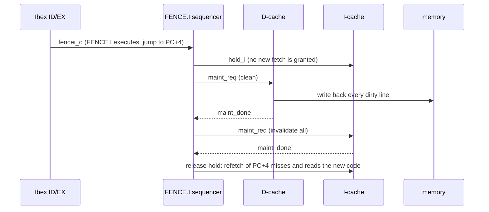

# L1 instruction and data caches

`rtl/cache/ibex_l1_cache.sv` is a single parameterised cache module, instantiated twice in
`ibex_cc_top`: as a **read-only I-cache** on the fetch port and a **D-cache** on the load/store
port. The D-cache is write-back/write-allocate by default, or write-through/no-allocate.
Replacement is in `rtl/cache/ibex_l1_repl.sv`. An optional **next-line prefetcher**
(`rtl/cache/ibex_l1_prefetch.sv`) sits behind the I-cache.

## Why caches for Ibex

Ibex targets tightly coupled single-cycle SRAM. Behind a realistic memory (flash, a bus fabric
or DRAM controller) every fetch and every load pays the full access latency. With a 10-cycle
memory the baseline core spends most of its time stalled (see
[evaluation.md](evaluation.md)). Ibex has an optional internal I-cache but no D-cache; here both are
external modules on standard interfaces, sharing one implementation.

## Organisation

| Property | Implementation |
|---|---|
| Geometry | `NumSets` × `NumWays` × `LineBytes` (powers of two); default 64 × 2 × 16 B = 2 KiB |
| Address split | `tag = addr[31 : log2(Line)+log2(Sets)]`, `set = addr[.. : log2(Line)]`, `word = addr[log2(Line)-1 : 2]` |
| Arrays | tag, data, per-line valid and dirty bits (flop arrays, asynchronous read) |
| Hit latency | 1 cycle: granted in cycle *N*, data in *N*+1 |
| Throughput | 1 access/cycle: a hitting request frees the pipeline register, so the next request is granted in the same cycle |
| Write policy | D$: write-back + write-allocate (default) or write-through + no-write-allocate (`DCacheWriteThrough`); the I$ is read-only |
| Replacement | invalid way first, then tree-PLRU / FIFO / LFSR-random (parameter) |
| Miss handling | blocking; dirty victim write-back, then line refill with `LineWords` pipelined requests, then replay |
| Uncached | `(addr & CacheableMask) != CacheableBase` bypasses the arrays (MMIO) |
| Errors | a bus error on any refill beat leaves the line invalid and returns `err` to the core |
| Maintenance | `maint_req_i`/`maint_done_o`: invalidate-all (I$, 1 cycle) or clean-all (D$) |

Both sides use the Ibex/OBI handshake: `req`/`gnt` for the address phase and `rvalid`/`rdata`/`err`
for the response phase, responses in order. The core side accepts exactly what Ibex issues
(word-aligned addresses plus byte enables; a misaligned access arrives as two requests).

## Control FSM

* **IDLE** holds at most one request in the pipeline register (`req_*_q`) and compares tags in the
  cycle after the grant. A read hit returns the word; a write hit merges the bytes selected by
  `be` into the line and sets its dirty bit. Either way the response goes out and a new request can
  be accepted in the same cycle.
* **EVICT** streams the victim line to memory (`LineWords` back-to-back write requests, then waits
  for all write responses) and clears its dirty bit.
* **REFILL** streams `LineWords` read requests and writes each response into the victim way as it
  arrives. On the last beat the tag is written and the line is marked valid. The FSM returns to
  IDLE, where the still-pending request is looked up again and now hits. Replaying costs one cycle
  but keeps a single response path, so every response is produced by the same hit logic.
* **BYPASS** forwards one uncached access unchanged. `err` is only passed through together with
  `rvalid` (OBI does not define `err` otherwise). In write-through mode every cacheable store also
  takes this path, after updating the line if it hit. A store miss does not allocate.
* **MAINT** walks every (set, way) and reuses EVICT for each dirty line.

## Timing

With main-memory latency *L* (request granted in cycle *t* → response in cycle *t + L*) and
*W* = `LineWords`:

| Access | Latency from grant to response |
|---|---|
| hit | **1** |
| clean miss | *L* + *W* + 2 (detect, *W* pipelined beats, replay) |
| dirty miss | ≈ 2(*L* + *W*) + 2 (write-back, then refill) |
| uncached / no cache | *L* |
| store, write-through mode | *L* (every store waits for memory: there is no write buffer) |

For the default *L* = 10, *W* = 4: a hit costs 1 cycle, a clean miss 16 cycles, an uncached access 10.
Ignoring pipelining effects, the average access time with a cache,
*h*·1 + (1 − *h*)(*L* + *W* + 2), beats *L* once the hit rate *h* exceeds (*W* + 2)/(*L* + *W* + 1) = 6/15 = **40 %**.
Every workload in the evaluation is far above that for instructions, and all but pointer-chasing
code are above it for data.

## Replacement (`ibex_l1_repl`)

* **Invalid-first:** if any way of the set is invalid it is filled first (lowest index), for every
  policy, so cold misses never evict valid data.
* **Tree pseudo-LRU:** `NumWays − 1` bits per set. Each node points to the less recently used half.
  A hit or fill flips the nodes on the path to point away from the accessed way; the victim is found
  by following the pointers from the root. For 2 ways this is exact LRU. An assertion checks that the
  way just touched is never the next victim.
* **FIFO:** per-set round-robin pointer advanced on each fill.
* **Random:** a free-running 16-bit maximal-length LFSR.

## FENCE.I coherence

The D-cache is write-back and the I-cache does not snoop it. Code written by a store can therefore
be (a) stuck in a dirty D-cache line and (b) shadowed by a stale I-cache line. RISC-V only requires
instruction fetch to observe earlier stores after a FENCE.I, so the core complex implements FENCE.I
as a cache-maintenance sequence:

Ibex already implements FENCE.I as a jump to the next instruction, which flushes the prefetch
buffer. `ibex_core` now also exports the pulse (`fencei_o`) that upstream uses to invalidate its
internal I-cache. The sequence also runs at every program exit (`crt0.S` executes FENCE.I), so
memory is coherent whenever the testbench inspects it. With the I-cache disabled the same
sequencer holds the raw fetch port while the D-cache is cleaned.

## Next-line prefetcher (`ibex_l1_prefetch`)

Instruction fetch is mostly sequential, so after a miss on line *X* the next miss is very likely
*X*+1. The prefetcher is a one-line **stream buffer** between the I-cache's memory port and main
memory. The cache does not know it exists: both sides speak the same OBI protocol.

| Step | Behaviour |
|---|---|
| trigger | the I-cache starts refilling line *X* from memory, *or* a refill of *X* is served from the buffer (so a sequential stream keeps running ahead) |
| issue | fetch line *X*+1 into the buffer, one beat at a time, only in cycles when the cache is not using the memory port, so demand misses always go first |
| hit | a later refill of *X*+1 is answered from the buffer at one word per cycle, as soon as each word has arrived, even if the prefetch is still in flight |
| flush | on FENCE.I (the cycle the I-cache invalidates) the buffer is dropped, and responses to prefetch beats still in flight are discarded |

Only cacheable addresses are prefetched, never MMIO. Responses to the cache always come back in
request order, even when some are served from the buffer and some from memory. Two small queues
track which is which.

`PfMemReqStable`, `PfMemRvalidExpected`, `PfUpRvalidExpected`, `PfNoFlushWithPendingReads` and
`PfPrefetchAddrCacheable` check the protocol and the flush rule. Cover points mark a hit while the
buffer is still filling, a dropped beat after a flush, and a demand request overtaking a prefetch.

## Performance events

`perf_access_o` (first lookup of each cacheable request, not the replay), `perf_miss_o`,
`perf_writeback_o` (one per dirty line written back) and `perf_bypass_o` (uncached access), plus
the prefetcher's `perf_pf_issue_o` and `perf_pf_hit_o`, feed `mhpmcounter19`–`26`
([performance_counters.md](performance_counters.md)).

I-cache accesses count *fetch requests*, including wrong-path prefetches that the core later
discards, so they exceed the number of retired instructions.

## Assertions (in `ibex_l1_cache.sv` / `ibex_l1_repl.sv`)

| Assertion | Property |
|---|---|
| `CoreRvalidHasRequest`, `CoreGntOnlyWhenIdle`, `CoreErrOnlyWithRvalid` | core-side protocol |
| `MemReqStable` | an ungranted memory request keeps address, `we`, `be`, `wdata` stable |
| `MemRvalidExpected` | memory responses only while beats are outstanding |
| `MemAddrAligned` | memory requests are word aligned |
| `HitOneHot` | a tag matches in at most one way |
| `RefillVictimClean` | a refill never overwrites a dirty line |
| `ReplayHitsAfterRefill` | the cycle after a successful refill is a hit |
| `DirtyImpliesValid`, `ReadOnlyNeverDirty`, `WriteThroughNeverDirty`, `ReadOnlyNeverWritesMemory` | state invariants |
| `CleanLeavesNoDirtyLines` | after a clean completes no line in the cache is dirty |
| `PlruNeverEvictsMru`, `ReplInvalidFirst` | replacement correctness |

Cover points (`CovReadHit`, `CovDirtyEviction`, `CovBackToBackHit`, `CovMaintWriteback`,
`CovRefillError`, `CovWriteThroughHit`, ...) mark the scenarios the tests must reach.

## Verification

* **Block level** (`dv/unit/tb_l1_cache.sv`): 20 000 constrained-random reads and writes per
  seed, with random byte enables, into a window of 4× the cache capacity plus sequential runs,
  uncached addresses and bus-error lines. It adds random memory stalls and latency, `hold_i`
  bursts, random maintenance requests, and resets in the middle of a refill or write-back. Every
  load is checked against a golden memory. After every clean the entire backing memory must equal
  the reference, which proves no dirty data was lost or misdirected. In write-through mode every
  store must already be in memory when it completes. For read-only caches with the prefetcher, a
  backdoor change to memory must be visible after an invalidate, which proves that stale lines were
  dropped from both the cache and the prefetch buffer. It runs on 8 configurations covering
  1/2/4/8 ways, 8–64 B lines, all three replacement policies, write-back, write-through, read-only
  and read-only with prefetcher, with 3–4 seeds each.
* **System level**: the memory scoreboard checks every core-visible load and fetch against a
  reference memory, and the riscv-tests, the cache-stress test, the FENCE.I self-modifying-code
  test and all benchmarks run on tiny direct-mapped, 4-way FIFO and 8-way random-replacement caches
  as well as the default geometry. See [verification.md](verification.md).

## Limitations and possible extensions

* Blocking: no hit-under-miss and no critical-word-first/early-restart (a miss waits for the full
  line). Both would reduce the miss penalty by up to *W* − 1 cycles.
* Write-through mode has no write buffer, so every store stalls for the full memory latency. It
  is there as a comparison point for the evaluation, not as a serious alternative.
* Flop-based arrays with an asynchronous read suit an FPGA/LUTRAM or a small ASIC cache. An SRAM
  version would read the arrays with the incoming (not yet registered) index, keeping the same
  1-cycle hit timing.
* The prefetcher is instruction-side only. A stride prefetcher on the D-side would help streaming
  kernels such as `stream` and `matmul` (see the evaluation).
