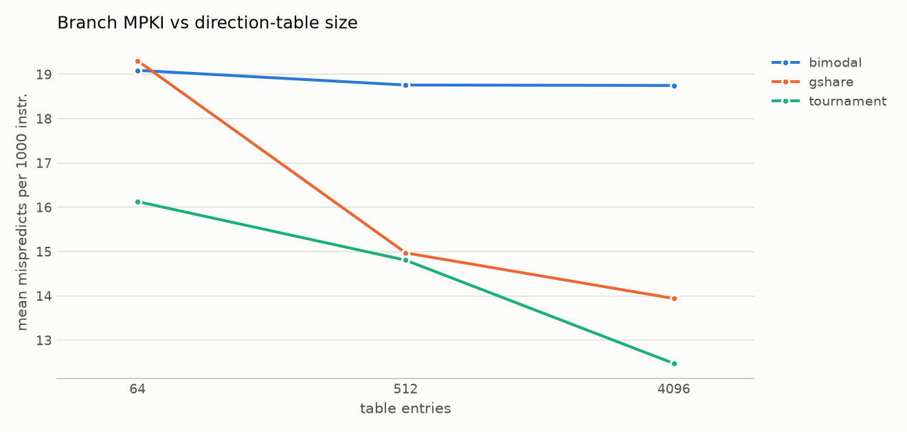
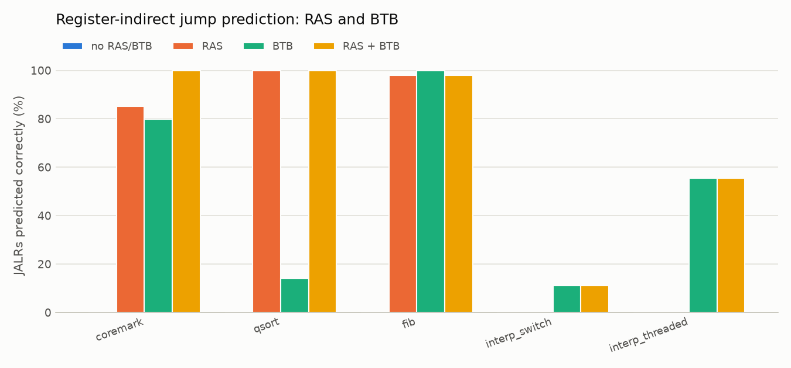
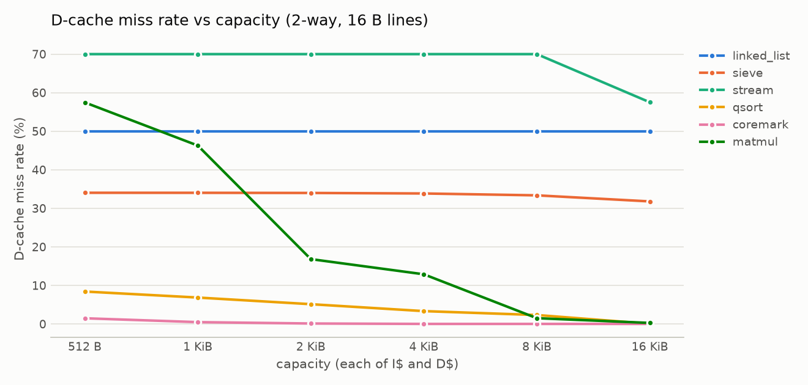
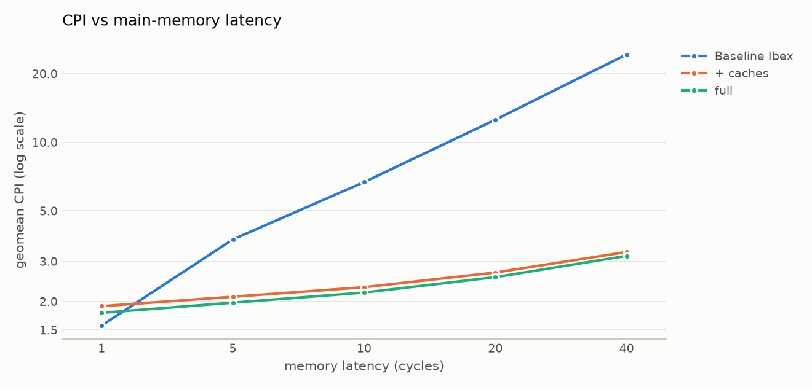

# Evaluation

This document measures what each micro-architectural feature is worth, explains the results, and
lists the limits of the method. The raw per-workload tables are generated into
[`results/evaluation.md`](../results/evaluation.md). The CSV files behind every number are in
[`results/`](../results/). Rerun everything with `make eval`, which takes about 25 minutes on 6 cores.

## 1. Method

### System

Every configuration is the core complex `ibex_cc_top` (Ibex plus the optional predictor, caches
and prefetcher) connected to the testbench memory `tb_mem`:

* separate instruction and data ports, pipelined and in order, with a fixed latency of
  **10 cycles** from grant to data (`+mem_latency`; the latency study sweeps 1 to 40);
* Ibex configured as upstream's `small` core: RV32IMC, 2-stage pipeline, no branch-target ALU,
  no writeback stage, fast multiplier;
* the full configuration: tournament predictor (512 entries, 8-bit history), an 8-entry RAS and
  a 16-entry BTB. It also has a 2 KiB 2-way I-cache with 16 B lines, PLRU replacement and the
  next-line prefetcher, and a 2 KiB 2-way write-back D-cache with 16 B lines and PLRU.

Each study changes one dimension of the full configuration. The exceptions are the ladder, which
adds features one at a time starting from stock Ibex, and the predictor studies, which disable
the RAS and BTB so that only direction prediction differs.

### Workloads

| Workload | What it stresses |
|---|---|
| `coremark` | EEMBC CoreMark, 2 iterations: list processing, matrix, state machine, CRC. Mixed control flow, small data set |
| `qsort` | recursive quicksort of 4,096 integers: data-dependent comparisons, recursion, 16 KiB working set |
| `matmul` | 40×40 integer matrix multiply: regular loops, column-strided accesses to one matrix |
| `bsearch` | 4,096 binary searches in a 32 KiB table: coin-flip branches, scattered loads |
| `crc32` | bitwise CRC-32 over 6 KiB: a tight 8-iteration inner loop, streaming reads |
| `linked_list` | pointer chasing through a randomly permuted 32 KiB list: every load misses |
| `stream` | STREAM copy/scale/add/triad on three 8 KiB arrays: unit stride, dirty lines |
| `fib` | naive recursive Fibonacci: calls and returns every few instructions |
| `sieve` | Sieve of Eratosthenes over a 62.5 KiB byte array: strided byte stores |
| `interp_switch` | bytecode interpreter with `switch` dispatch: one indirect jump, many targets |
| `interp_threaded` | the same interpreter with computed-goto dispatch: one indirect jump per handler |

The predictor studies also report six assembly micro-kernels (`bp_patterns`) whose branch
patterns are known exactly: always taken, alternating, period 4, period 8, random, and a branch
correlated with an earlier one.

All programs are compiled with xPack GCC 14.2 at `-O2 -march=rv32imc_zicsr_zifencei` and
simulated with Verilator 5.020. The run metadata is in [`results/meta.json`](../results/meta.json).

### Metrics

Every number comes from the core's own hardware performance counters (see
[performance_counters.md](performance_counters.md)). They are read by `perf_start()` /
`perf_finish()` around each workload's measured region, so set-up code and `printf` are excluded.

| Metric | Definition |
|---|---|
| CPI / IPC | `mcycle / minstret` and its inverse |
| speedup | baseline CPI / CPI on the same workload |
| branch accuracy | 1 − mispredicted conditional branches / conditional branches |
| MPKI | mispredicted conditional branches per 1,000 instructions |
| JALRs predicted right | (RAS + BTB predictions − wrong JALR targets) / all JALRs |
| miss rate | cache misses / cache accesses (loads + stores for the D-cache) |
| fetch / data stall % | cycles the core waits for instruction fetch / for a data access, as a share of all cycles |
| prefetch accuracy / coverage | refills served by the prefetch buffer / lines prefetched, and / I-cache misses |

CPI, IPC and speedup are summarised with the **geometric mean** over the 11 workloads, so each
workload counts equally. Rates such as accuracy, MPKI and miss rate use the arithmetic mean.

## 2. Feature ladder: where the time goes

| Configuration | geomean CPI | geomean IPC | speedup | fetch stall | data stall |
|---|---|---|---|---|---|
| Baseline Ibex | 6.686 | 0.150 | 1.00× | 46.6% | 35.7% |
| + branch prediction only | 6.054 | 0.165 | 1.10× | 41.0% | 39.5% |
| + I-cache | 3.570 | 0.280 | 1.87× | 4.8% | 59.8% |
| + I-cache + D-cache | 2.311 | 0.433 | 2.89× | 6.4% | 36.7% |
| + prefetcher | 2.310 | 0.433 | 2.89× | 6.3% | 36.7% |
| + branch prediction (full) | **2.189** | **0.457** | **3.06×** | 1.2% | 38.6% |

(Stall columns are arithmetic means of the per-workload percentages.)

**Memory latency dominates stock Ibex.** With 10-cycle memory and no caches, Ibex spends 47% of
its cycles waiting for instructions and 36% waiting for data. Its prefetch buffer keeps at most
two fetches in flight, so fetch alone limits it to about one 32-bit word every 5 cycles. The
I-cache removes almost all of the fetch stall (1.87×). The D-cache then converts most of the
remaining data stall (2.89× cumulative).

**Branch prediction is worth 10% without caches and 5.5% with them.** Without caches, every
taken branch pays a 10-cycle refetch, so each avoided mispredict saves about **5.8 cycles**
(summed over all workloads). With a 1-cycle I-cache the same mispredict costs only the ID/EX
redirect, so it saves about **1.1 to 1.5 cycles**. The final step also removes most of the
remaining fetch stall (6.3% → 1.2%). A correctly predicted taken branch no longer leaves ID/EX
waiting for its target to be refetched.

**Per workload** the full configuration is 1.09× (`stream`) to 4.65× (`fib`) faster than stock
Ibex. The small-footprint, control-heavy workloads (`coremark`, `crc32`, `fib`, both interpreters)
gain 4.2× to 4.7×. `linked_list` gains 1.55× and `stream` 1.09×: every node visited in
`linked_list` misses, and `stream` thrashes the 2-way D-cache (section 8).

**A D-cache can make a program slower.** Adding the D-cache makes `stream` 37% slower
(CPI 4.60 → 6.28) and `bsearch` 14% slower (2.39 → 2.73). With 10-cycle memory and 16 B lines, a
clean miss costs *L* + *W* + 2 = 16 cycles and a dirty miss about 30, against 10 for an uncached
access. A cache therefore only pays off above a hit rate of (*W* + 2)/(*L* + *W* + 1) = 40%.
`stream` hits 30% of the time and `bsearch` 17%. Both fall below that break-even point.

## 3. Branch direction prediction

All six direction predictors, with 512-entry tables, an 8-bit history and no RAS/BTB, on the full
cache configuration:

| | none | static BTFN | 1-bit | bimodal | gshare | tournament |
|---|---|---|---|---|---|---|
| mean accuracy | 31.5% | 86.4% | 85.1% | 88.7% | **93.0%** | 92.7% |
| mean MPKI | 117.8 | 23.7 | 24.7 | 18.8 | 15.0 | **14.8** |
| geomean CPI | 2.310 | 2.204 | 2.208 | 2.199 | **2.188** | 2.191 |

Selected workloads (accuracy):

| Workload | none | static | 1-bit | bimodal | gshare | tournament |
|---|---|---|---|---|---|---|
| `coremark` | 43.6 | 82.3 | 86.8 | 92.2 | 91.5 | **94.3** |
| `qsort` | 42.4 | 56.2 | 64.7 | 69.1 | 64.4 | **70.4** |
| `bsearch` | 50.3 | 80.5 | 78.9 | 81.4 | 81.0 | **81.5** |
| `crc32` | 11.1 | 88.9 | 77.8 | 88.9 | **100.0** | 88.9 |
| `fib` | 61.8 | 50.0 | 38.2 | 50.0 | **92.0** | 90.4 |

Micro-kernels (accuracy, including each kernel's always-taken loop branch):

| Kernel | static | 1-bit | bimodal | gshare | tournament |
|---|---|---|---|---|---|
| always taken | 50.0 | 100.0 | 100.0 | 99.9 | 100.0 |
| alternating | 75.0 | 50.0 | 75.0 | 99.9 | 99.9 |
| period 4 | 62.5 | 75.0 | 87.5 | 99.8 | 99.9 |
| period 8 | 81.2 | 62.5 | 81.2 | 87.4 | 87.4 |
| random | 74.9 | 75.3 | 75.6 | 74.9 | 75.9 |
| correlated | 66.6 | 67.1 | 67.5 | 79.3 | **81.4** |

**The kernels behave as the textbook predicts.**
* The 1-bit predictor mispredicts every alternation and both edges of every loop exit.
* Bimodal learns bias but not patterns.
* gshare learns alternating and period-4 patterns and the correlated branch.
* Nothing learns the random branch.
* Period 8 exceeds the history available: the kernel's loop branch interleaves with the measured
  branch, so seeing a whole period takes 14 bits, more than the 8-bit history holds.

**Most of the gain comes from predicting taken branches at all.** Going from no prediction to
static BTFN removes 80% of mispredictions and gives 4.8% of the 5.4% CPI improvement. From static
to the tournament predictor, MPKI falls another 38% (23.7 → 14.8), but CPI improves only 0.6%.
Each avoided mispredict saves about 1.1 cycles on this 2-stage pipeline with a 1-cycle I-cache.

**History helps where outcomes follow control flow.** `fib`'s base-case test depends on the
depth of the recursion, which the global history encodes: gshare reaches 92% where every
PC-indexed predictor sits at 50% or below. `qsort` and `bsearch` compare random data, so no
predictor exceeds 71% and 82%. The history then only dilutes each branch over more table entries,
which is why gshare is worse than bimodal on `qsort` (64.4% vs 69.1%). The tournament predictor
is the best or within 1.6 points of the best on every workload except `crc32`, and it has the
lowest mean MPKI.

**Why the tournament predictor loses `crc32` (a timing effect of the non-speculative history).**
GCC if-converts CRC's data-dependent test, so the only branches left are an 8-iteration inner
loop (7 taken, 1 not taken) and the byte loop. gshare predicts both perfectly, yet the tournament
predictor stays at bimodal's 88.9%. The cause is that the global history is updated when a
branch *resolves*, not when it is predicted. The history seen by the byte-loop branch therefore
depends on whether the inner-loop exit just before it was predicted correctly:

* If the exit was predicted correctly, the byte-loop branch is predicted before the exit
  resolves. Its gshare index then differs from the exit's, and gshare stays at 100%.
* If the exit was mispredicted, the refetch delays the byte-loop branch until after the update.
  Its index (`0x1d7 ⊕ 0xfe`) then equals the exit's index (`0x1d6 ⊕ 0xff`). The two branches,
  with opposite outcomes, share one counter, and gshare mispredicts both.

The tournament predictor starts with its chooser biased towards bimodal, which mispredicts the
exit, so it lands in the second state. There gshare is never right when the components disagree,
so the chooser never switches. A block-level replay of this branch stream against
`ibex_bp_dynamic`, which models when each branch resolves, reproduces both numbers exactly (gshare
100%, tournament 88.9%). With the resolution timing left out of the model, gshare falls to 77.8%.
That is the colliding state, reached from the start. With 4,096 entries and
a 12-bit history, the tournament predictor reaches 100% as well (section 4). A speculative
history with repair would remove this timing dependence (see
[branch_prediction.md](branch_prediction.md)).

## 4. Predictor table size

| Entries (history bits) | bimodal | gshare | tournament |
|---|---|---|---|
| 64 (6) | 88.6% / 19.1 | 90.4% / 19.3 | 91.8% / 16.1 |
| 512 (8) | 88.7% / 18.8 | 93.0% / 15.0 | 92.7% / 14.8 |
| 4,096 (12) | 88.8% / 18.7 | 93.7% / 13.9 | **94.4% / 12.5** |

(mean accuracy / mean MPKI)

Bimodal is saturated at 64 entries: these workloads have few static branches, so there is little
aliasing to remove. gshare needs the space because each branch occupies one entry per history
pattern. At 64 entries its accuracy on CoreMark drops to 85.8%, below bimodal. The tournament
predictor inherits the best of both at every size and is the most accurate at 4,096 entries. CPI
barely moves (2.199 → 2.184 across the whole table) for the reason given in section 3.

## 5. Return address stack and indirect-jump BTB

| JALRs predicted right | none | RAS only | BTB only | RAS + BTB |
|---|---|---|---|---|
| `coremark` | 0% | 85.1% | 79.9% | **99.9%** |
| `qsort` | 0% | 99.9% | 14.0% | **99.9%** |
| `fib` | 0% | 97.9% | **100.0%** | 97.9% |
| `interp_switch` | 0% | 0% | 11.1% | 11.1% |
| `interp_threaded` | 0% | 0% | 55.5% | 55.5% |

* **The RAS predicts returns almost perfectly.** With the RAS alone, not one prediction is wrong on these workloads.
  The 2% of `fib` returns it leaves unpredicted come from recursion deeper than its 8 entries:
  the stack saturates on the way down and runs empty on the way up. GCC turned one of `fib`'s two
  recursive calls into a loop, so every return goes to the same call site, and a last-target BTB
  also predicts it (100%). The BTB alone gets only 14% on `qsort`, whose returns go to several
  call sites. Combined, the RAS handles the returns and the BTB handles CoreMark's function
  pointers: 99.9%.
* **A last-target BTB is poor for `switch` dispatch (11%).** One jump-table JALR dispatches every
  bytecode. Threaded dispatch gives each handler its own JALR, whose successors are more
  repetitive, so accuracy rises to 55%. That is the classic argument for threaded interpreters,
  measured on this core.
* **Correct JALR predictions barely change CPI on Ibex (geomean 2.191 → 2.189).** Without a
  branch-target ALU, every jump spends two cycles in ID/EX: one to compute the target and one to
  compute the link address. Ibex redirects fetch in the first cycle. With a 1-cycle I-cache hit,
  the target arrives just as the jump leaves ID/EX, so the redirect costs nothing to hide. `fib`
  runs in exactly the same number of cycles with 10,713 correct return predictions as with none.
  A correct prediction pays off only when the target misses in the I-cache (qsort: 1 cycle per
  return) or on a core without an I-cache. The RAS and BTB are verified and complete. On this
  pipeline their value is in removing the redirect from the fetch path, not in CPI.

## 6. I-cache prefetching

| | 512 B, no prefetch | 512 B + prefetch | 2 KiB, no prefetch | 2 KiB + prefetch |
|---|---|---|---|---|
| geomean CPI | 2.203 | 2.201 | 2.189 | 2.189 |
| mean I-cache miss rate | 0.09% | 0.09% | 0.02% | 0.02% |
| misses served by prefetch (coverage) | – | 79% | – | 81% |
| prefetched lines used (accuracy) | – | 77% | – | 79% |

The next-line prefetcher works: about 80% of I-cache refills are served from its buffer, and
about 80% of the lines it fetches are used. There is almost nothing for it to do on these
workloads. They are loop kernels whose code fits even in 512 B, so the miss rate is already below
0.1%. The largest effect is on CoreMark with a 512 B I-cache (CPI 1.54 → 1.52, 1.3%). A larger
program, or a smaller cache, would show more.

## 7. D-cache write policy

| | write-back + allocate | write-through + no-allocate |
|---|---|---|
| geomean CPI | **2.189** | 2.489 (+14%) |
| write-backs per 1,000 instructions | 15.9 | 0 |
| `fib` CPI | **1.52** | 3.65 |
| `sieve` CPI | 3.84 | **3.34** |
| `stream` CPI | 6.15 | **3.68** |

Write-back wins overall because stack traffic dominates. `fib` stores 46,368 times to a few hot
stack lines. Write-back absorbs those stores in the cache, while write-through sends each one to
10-cycle memory (2.4× slower). The two store-streaming workloads do better with write-through.
With no-write-allocate, a store miss does not fetch a line that will be overwritten, and no dirty
line is ever written back: write-back `sieve` performs 58,936 write-backs. A write buffer would
give write-through most of write-back's CPI on `fib`. It was left out to keep the D-cache
blocking and simple.

## 8. Cache size, associativity, line size and replacement

Each row changes both caches together. The mean D-cache miss rate is the arithmetic mean over
workloads.

**Size** (2-way, 16 B lines):

| | 512 B | 1 KiB | 2 KiB | 4 KiB | 8 KiB | 16 KiB |
|---|---|---|---|---|---|---|
| geomean CPI | 2.341 | 2.289 | 2.189 | 2.160 | 2.096 | **2.014** |
| mean D-cache miss rate | 28.5% | 27.2% | 24.1% | 23.3% | 20.7% | 16.3% |

* The miss rates fall where the working sets fit:
  * `matmul` (57.5% → 1.5% at 8 KiB);
  * `qsort` (8.4% → 0.1% at 16 KiB);
  * `crc32`'s 6 KiB buffer (6.2% → 0 at 8 KiB);
  * `bsearch`'s hot upper tree levels (85.7% → 39.2%).
* `linked_list`'s 32 KiB of randomly ordered nodes misses 50% at every size, since every node is
  a new line and the second load per node hits.
* `linked_list` also gets *slower* as the cache grows (CPI 4.61 → 4.91). Setup code dirties the
  nodes before the measured region starts. A larger cache keeps more of those dirty lines, which
  are then written back during the measurement (26 → 924 write-backs). See section 10.

**Associativity** (2 KiB, 16 B lines):

| | 1-way | 2-way | 4-way | 8-way |
|---|---|---|---|---|
| geomean CPI | 2.269 | 2.189 | 2.056 | **2.032** |
| mean D-cache miss rate | 27.2% | 24.1% | 19.9% | 18.3% |
| `stream` miss rate / CPI | 100% / 8.33 | 70% / 6.15 | **25% / 3.20** | 25% / 3.20 |

Associativity is the most effective single change after adding the caches. `stream`'s three
8 KiB arrays are aligned, so element *i* of each maps to the same set. A direct-mapped cache
misses on every access. Two ways still thrash because the triad kernel touches three arrays.
With four ways the miss rate reaches the ideal 1 in 4 for 16 B lines, and `stream` becomes 2.6×
faster. Only then does the D-cache help it: CPI 3.20, against 4.60 with the I-cache alone in the
ladder. `matmul`'s strided column
accesses also benefit steadily (20.3% → 12.9%).

**Line size** (2 KiB, 2-way):

| | 8 B | 16 B | 32 B | 64 B |
|---|---|---|---|---|
| geomean CPI | 2.232 | **2.189** | 2.220 | 2.506 |
| mean D-cache miss rate | 28.9% | 24.1% | 20.9% | 21.7% |
| clean miss penalty (*L* + *W* + 2) | 14 | 16 | 20 | 28 |

The miss rate falls up to 32 B, but CPI is best at 16 B. The refill is blocking and not
critical-word-first, so a longer line costs one cycle per extra word on every miss. It also
leaves fewer sets at a fixed capacity:

* `matmul` jumps from 10.7% to 39.8% misses at 64 B (only 16 sets);
* `linked_list`, which uses one word per line, slows from 4.23 to 6.78;
* spatially local workloads still gain (`sieve` 4.20 → 3.60, `qsort` 1.85 → 1.57).

**Replacement** (2 KiB, 4-way, 16 B lines):

| | PLRU | FIFO | random |
|---|---|---|---|
| geomean CPI | **2.056** | 2.057 | 2.101 |
| mean D-cache miss rate | 19.9% | 19.9% | 20.8% |

PLRU and FIFO are practically identical here. Random costs 2%: it sometimes evicts a line a
stream is still using (`stream` 25% → 33.5% misses, `matmul` 14.7% → 20.5%). The exception is
`bsearch`, where random does slightly better (79.3% vs 83.6%). Its access pattern repeatedly
cycles through more lines than fit, which is the textbook case where LRU-like policies evict
exactly the line needed next.

## 9. Memory latency

| Memory latency (cycles) | Baseline Ibex | + caches | full | full vs baseline | prediction's share (caches → full) |
|---|---|---|---|---|---|
| 1 | **1.567** | 1.907 | 1.783 | 0.88× | 7.0% |
| 5 | 3.746 | 2.098 | **1.976** | 1.90× | 6.2% |
| 10 | 6.686 | 2.310 | **2.189** | 3.05× | 5.5% |
| 20 | 12.567 | 2.680 | **2.558** | 4.91× | 4.8% |
| 40 | 24.327 | 3.299 | **3.172** | 7.67× | 4.0% |

(geomean CPI)

* **Stock Ibex is latency-bound.** Its CPI grows by about 0.58 for every extra cycle of memory
  latency. The full configuration grows by 0.036, 16 times less.
* **With 1-cycle memory the caches make the core 12% slower.** A cache hit is no faster than
  memory, but a miss costs *L* + *W* + 2 = 7 cycles instead of 1. The break-even formula of
  section 2 gives a required hit rate of (*W* + 2)/(*L* + *W* + 1) = 100%. Interpolating between
  the measured points puts the crossover near 2 cycles, so the caches pay off for any realistic
  memory.
* **Branch prediction saves a fixed amount, about 0.12 CPI at every latency.** With the caches
  in place, a mispredict costs the same pipeline redirect whatever the memory latency. As the
  remaining memory stalls grow, that fixed saving becomes a smaller share (7.0% → 4.0%).

## 10. Threats to validity

* **Memory model.** The latency is fixed, and there is no contention between the instruction and
  data ports, no DRAM row effects and no bus arbitration. Absolute CPIs are therefore optimistic
  for a real SoC. The trends are what matter.
* **Small programs.** The kernels' code fits in 512 B, so the I-cache and prefetcher studies
  understate their value for large programs. CoreMark runs for 2 iterations as a workload, not as
  a compliant CoreMark score.
* **Warm state.** Measured regions start with whatever the set-up code left in the caches and
  predictor. That is realistic for a steady-state kernel, but it produces effects like
  `linked_list`'s write-backs in section 8.
* **Compiler.** GCC 14.2 at `-O2` decides which branches exist (for example, `crc32`'s
  if-conversion). Another compiler or optimisation level changes the branch mix.
* **Non-speculative history.** Updating the global history at resolution makes gshare and the
  tournament predictor slightly timing-dependent (section 3). A different memory latency can
  change their accuracy on the same branch stream.
* **No physical design.** The tables and cache arrays are flip-flops read combinationally. The
  design was not synthesised, so there are no area, power or frequency numbers, and a real
  implementation would need SRAM macros and possibly an extra fetch stage.
* **Equal weighting.** The geometric mean weights every workload equally. The suite is chosen to
  cover behaviours, not to represent one application domain.
