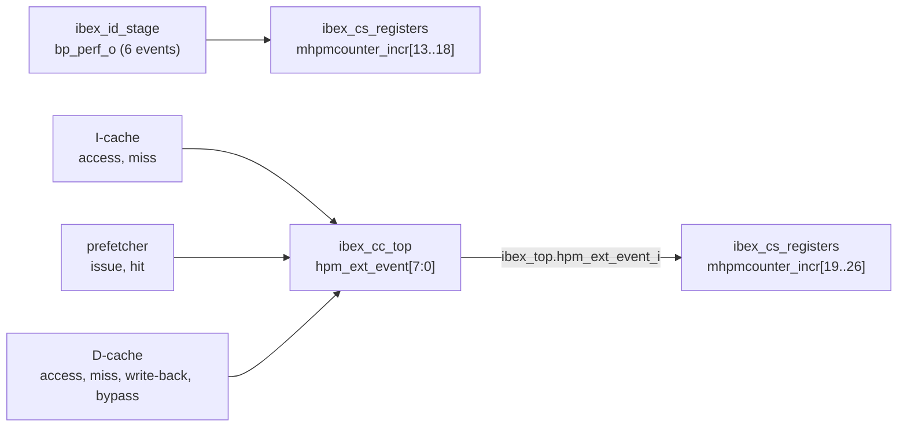

# Hardware performance counters

Every number in the evaluation comes from the core's own RISC-V hardware performance monitor
(HPM), not from testbench probes, so the same measurements could be made on silicon. Upstream Ibex
implements `mcycle`, `minstret` and ten events on `mhpmcounter3`–`12`. This project adds 14
events on `mhpmcounter13`–`26`: six for branch prediction and eight for the L1 caches and
the prefetcher.

## Event map

| Counter | Event | Source | |
|---|---|---|---|
| `mcycle` | cycles | CSR file | upstream |
| `minstret` | instructions retired | CSR file | upstream |
| `mhpmcounter3` | cycles waiting for data memory | LSU | upstream |
| `mhpmcounter4` | cycles waiting for instruction fetch | IF | upstream |
| `mhpmcounter5` | loads | LSU | upstream |
| `mhpmcounter6` | stores | LSU | upstream |
| `mhpmcounter7` | jumps (JAL/JALR) | controller | upstream |
| `mhpmcounter8` | conditional branches | ID/EX | upstream |
| `mhpmcounter9` | taken conditional branches | controller | upstream |
| `mhpmcounter10` | compressed instructions retired | ID/EX | upstream |
| `mhpmcounter11` | multiply wait cycles | EX | upstream |
| `mhpmcounter12` | divide wait cycles | EX | upstream |
| `mhpmcounter13` | conditional-branch direction mispredicts | ID/EX (`bp_perf_o.br_mispred`) | **new** |
| `mhpmcounter14` | … of which were predicted taken but not taken | ID/EX (`br_mispred_t`) | **new** |
| `mhpmcounter15` | register-indirect jumps (JALR, C.JR, C.JALR) executed | ID/EX (`jalr`) | **new** |
| `mhpmcounter16` | … predicted by the return address stack | ID/EX (`ras_pred`) | **new** |
| `mhpmcounter17` | … predicted by the indirect-jump BTB | ID/EX (`btb_pred`) | **new** |
| `mhpmcounter18` | … predicted with a wrong target | ID/EX (`jalr_mispred`) | **new** |
| `mhpmcounter19` | I-cache accesses | `ibex_l1_cache` (I) | **new** |
| `mhpmcounter20` | I-cache misses | `ibex_l1_cache` (I) | **new** |
| `mhpmcounter21` | next-line prefetches issued | `ibex_l1_prefetch` | **new** |
| `mhpmcounter22` | I-cache refills served by the prefetch buffer | `ibex_l1_prefetch` | **new** |
| `mhpmcounter23` | D-cache accesses (cacheable loads and stores) | `ibex_l1_cache` (D) | **new** |
| `mhpmcounter24` | D-cache misses | `ibex_l1_cache` (D) | **new** |
| `mhpmcounter25` | D-cache dirty lines written back | `ibex_l1_cache` (D) | **new** |
| `mhpmcounter26` | uncached (MMIO) data accesses | `ibex_l1_cache` (D) | **new** |

The counters are 40 bits wide (`MHPMCounterWidth`), readable as 64-bit values through the
`mhpmcounterN`/`mhpmcounterNh` pairs. They can be frozen with `mcountinhibit`. Counters for a
feature that is not instantiated (for example the cache events when `DCacheEn = 0`) stay at zero.

The table is defined once in `rtl/ibex_uarch_pkg.sv` (`HPM_IDX_*`, `bp_perf_t`,
`hpm_ext_event_e`) and mirrored in `sw/common/perf.h`. If you change one, change the other: the
`hpm_counters` test will catch a mismatch.

## How the events reach the CSR file



* **Branch events** are generated in `ibex_id_stage`, where branches resolve. They are one-cycle
  pulses in the same cycle as the predictor training update, so every event matches exactly one
  training event.
* **Cache events** come from outside the core. `ibex_cc_top` packs them into an 8-bit vector
  that enters through a new `ibex_top` port, `hpm_ext_event_i`. `ibex_top` passes the vector to
  the CSR file and, in lockstep mode, delays it for the shadow core together with the other
  inputs.
* `MHPMCounterNum` defaults to `HPM_NUM_COUNTERS` (24), so all 24 counters exist in every
  configuration of `ibex_cc_top`.

## Definitions and caveats

* **Direction mispredict** (`13`) counts conditional branches whose predicted direction was wrong.
  With no predictor (`BpNone`) Ibex implicitly predicts "not taken", so every taken branch counts
  as a mispredict. That keeps the metric comparable across all configurations.
* **JALR events** (`15`–`18`) count register-indirect jumps. JAL and C.J are not included: their
  targets are decoded from the instruction and they are always predicted correctly once they reach
  the predictor.
* **I-cache accesses** (`19`) count *fetch requests*, including wrong-path prefetches that the
  core later discards, so they exceed the number of retired instructions. The miss rate is still
  meaningful: wrong-path fetches are real memory traffic.
* **D-cache accesses** (`23`) count the first lookup of each cacheable request, not the internal
  replay after a refill. A misaligned access that Ibex splits into two requests counts twice.
* **Write-backs** (`25`) count dirty *lines*, including those written back by a FENCE.I clean. In
  write-through mode the counter stays at zero because every store goes straight to memory.
* **Wait cycles** (`3`, `4`) are the upstream Ibex definitions. They count cycles where the
  pipeline is stalled on that side, and the two can overlap.

## Measuring a region of code

`sw/common/perf.h` wraps the counters:

```c
#include "perf.h"

perf_start();              // freeze, zero every counter, unfreeze
kernel();                  // code under test
perf_finish("kernel");     // freeze, read all 26 counters, print one PERF line
```

`perf_start`, `perf_stop` and `perf_read` are force-inlined, so no call/return of the helpers
lands inside the measured region. The output is a single machine-readable line:

```
PERF name=kernel cycles=12345 instret=6789 dside_wait=... br_mispred=... ic_miss=... dc_miss=...
```

`scripts/simlib.py` parses these lines. `scripts/evaluate.py` turns them into the derived metrics
below. A program may print several PERF lines; `sw/bench/bp_patterns` and `sw/bench/interp` do this
to report each kernel separately.

## Derived metrics

| Metric | Formula |
|---|---|
| CPI / IPC | `cycles / instret`, `instret / cycles` |
| Branch accuracy | `1 − br_mispred / branches` |
| Branch MPKI | `1000 · br_mispred / instret` |
| JALRs predicted correctly | `(ras_pred + btb_pred − jalr_mispred) / jalr` |
| I-/D-cache miss rate | `ic_miss / ic_access`, `dc_miss / dc_access` |
| I-/D-cache MPKI | `1000 · miss / instret` |
| Prefetch accuracy | `ic_pf_hit / ic_pf_issue` (prefetched lines that were used) |
| Prefetch coverage | `ic_pf_hit / ic_miss` (misses served by the prefetcher) |
| Fetch- / data-stall fraction | `iside_wait / cycles`, `dside_wait / cycles` |

## Verification of the counters

`sw/tests/hpm_counters` runs six short kernels whose event counts are known exactly:

1. a countdown loop with exactly 1000 conditional branches, 999 of them taken
2. 100 loads of the same word (one D-cache miss, then 99 hits)
3. stores to 16 distinct lines, after which FENCE.I must write back exactly 16 dirty lines
4. uncached (MMIO) accesses and jumps
5. 100 calls to a leaf function whose *first* instruction is `ret` (the RAS must already hold the
   return address when the return is fetched)
6. indirect calls through a function pointer (BTB, not RAS)

It checks every new counter against the expected value. The expected values depend on the
configuration, which the program reads from the testbench configuration register at `0x2000_0100`.
The test runs on every regression configuration, including those where a feature is disabled and
its counter must stay at zero.
