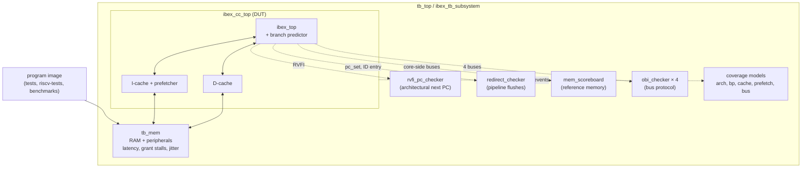

# Verification

The verification environment is adapted from the **CV32E40P example testbench**
(`cv32e40p/example_tb/core`), OpenHW Group's reference environment for its RISC-V core. It keeps
CV32E40P's memory map, virtual peripherals and pass/fail conventions, replaces the core with the
extended Ibex core complex, and adds the checkers, assertions and coverage that the changes to
fetch and memory need.

## What was reused and what is new

| CV32E40P example testbench | This project | Change |
|---|---|---|
| `tb_top.sv` | `dv/tb/tb_top.sv` | pure-SystemVerilog top (no C++ harness), built with `verilator --binary --timing`; all micro-architecture parameters overridable with `-G` |
| `cv32e40p_tb_subsystem.sv` | `dv/tb/ibex_tb_subsystem.sv` | CV32E40P core → `ibex_cc_top`; instantiates all checkers, coverage models and the Ibex tracer |
| `mm_ram.sv`, `dp_ram.sv` | `dv/tb/tb_mem.sv` | same memory map and putchar / timer / exit / signature registers; **configurable pipelined latency** so cache effects are visible; bus errors instead of `$fatal` on unmapped addresses, so the fault path is exercised; configuration register at `0x2000_0100` |
| `riscv_gnt_stall.sv`, `riscv_rvalid_stall.sv` | `tb_mem.sv` (`+gnt_stall`, `+rvalid_jitter`) | re-implemented with Verilator 5 timing; the originals are Questa-only |
| `amo_shim.sv`, interrupt generator | – | removed: Ibex has no A extension, and the PULP interrupt generator is CV32E40P-specific |
| – | `dv/checkers/*`, `dv/coverage/*`, `dv/unit/*` | **new**: see below |
| test status at `0x2000_0000` = 123456789 | `sw/riscv-tests/env/riscv_test.h`, `sw/common/crt0.S` | same convention; the riscv-tests environment was ported to it |

## Environment

### Checkers

Each checker targets one way the new logic could break the core, and none of them depends on the
predictor's or caches' internals:

* **`rvfi_pc_checker`: control flow.** From the RISC-V Formal Interface (RVFI) retirement trace, it
  recomputes the architecturally correct next PC of every retired instruction from the encoding and
  the source-register values, and compares it with the PC of the next retired instruction. An
  unrepaired branch misprediction, a wrong RAS or BTB target, or a lost redirect makes the core
  retire a wrong-path instruction, and this check catches it. It also checks that `x0` is never
  written.
* **`redirect_checker`: pipeline flushes.** After every redirect from ID/EX (a wrong "taken"
  prediction, a missed taken branch, a wrong JALR target), the next instruction that enters ID must
  be the one at the redirect address. This checks one stage earlier than RVFI, where a failure is
  easier to debug.
* **`mem_scoreboard`: caches are invisible.** A flat reference memory is updated by every store the
  core issues. Every load and every instruction fetch on the core side of the caches must return the
  reference value. The one exception is code modified since the last FENCE.I, which RISC-V allows
  to be stale. The scoreboard knows nothing about lines, sets or dirty bits, so any refill,
  eviction or write-back bug shows up as a data mismatch.
* **`obi_checker` (×4): bus protocol.** On both sides of both caches: a request is held until it is
  granted, attributes stay stable, responses only arrive for outstanding requests, the
  outstanding-transaction limit holds, and addresses are never X.

In addition, **SVA in the RTL** (`UARCH_ASSERT`, 32 properties in the predictor, caches,
replacement, prefetcher and FENCE.I sequencer) is evaluated in every simulation (`--assert`). See
[branch_prediction.md](branch_prediction.md#assertions-in-ibex_bp_dynamicsv) and
[caches.md](caches.md#assertions-in-ibex_l1_cachesv--ibex_l1_replsv).

A test passes only if the program reports success **and** no checker or assertion fired.

### Functional coverage

Verilator 5 does not support SystemVerilog `covergroup`s, so coverage is modelled as explicit named
bins (`dv/coverage/uarch_coverage.sv`, registered through `tb_pkg`). Every simulation writes its
bins to a file, and `scripts/regress.py` merges them across the regression:

| Model | Bins cover |
|---|---|
| `arch_cov` | retired control-transfer mix: conditional branches × direction × taken × compressed, JAL/C.J, JALR, traps, interrupts |
| `bp_cov` | prediction × outcome matrix at resolution, recovery after a wrong "taken", JALR target recovery; RAS push/pop/overflow/co-routine/wrong return; BTB hit/miss/wrong target; tournament component agreement and chooser decisions |
| `cache_cov` (I and D) | read/write hit and miss, back-to-back hits, dirty eviction, refill under memory back-pressure, bypass, maintenance, hits in every way |
| `prefetch_cov` | prefetch issued, hit, hit while filling, dropped after FENCE.I |
| `bus_cov` | grant stalls, two outstanding fetches, data bus errors |

### Block-level testbenches

| Testbench | Stimulus | Checking |
|---|---|---|
| `dv/unit/tb_l1_cache.sv` | 20 000 constrained-random transactions per seed: random and sequential addresses over 4× the capacity, random byte enables, uncached and bus-error lines, back-to-back requests, `hold_i`, random maintenance, reset during refill/write-back; memory with random stalls and latency | golden memory on every load; full memory comparison after every clean; write-through visibility; stale-data removal after invalidate (cache and prefetch buffer); the cache's own SVA |
| `dv/unit/tb_bp.sv` | 20 000 random instructions; synthetic branch streams; random nested call/return sequences up to 3× the RAS depth; aliasing indirect jumps | reference decoder; per-predictor accuracy bounds on each stream; software shadow stack for the RAS; no false BTB hits; the predictor's own SVA |

They run on 8 cache configurations (1/2/4/8 ways, 8–64 B lines, PLRU/FIFO/random, write-back,
write-through, read-only with and without the prefetcher) and 6 predictor configurations (every
mode plus a deliberately tiny one), with several seeds each (`UNIT_CONFIGS` in
`scripts/uarch_configs.py`).

## Tests

| Category | Programs | What they target |
|---|---|---|
| ISA compliance | 51 riscv-tests (`rv32ui`, `rv32um`, `rv32uc`) | every instruction, run through the predictor and caches |
| `branch_torture` | assembly | 12 blocks: forward/backward taken and not taken, branch-to-branch chains, compressed branches, 32-bit branches at halfword PCs and across cache lines, jump-to-jump, a load-use hazard feeding a branch, alternating patterns, nested loops; poison values on every wrong path, and the result is checked against a sum computed at build time |
| `call_return` | C | recursion 3× deeper than the RAS, mutual recursion, `x5` link register, co-routine swap, function pointers whose target changes |
| `fence_i_smc` | C | self-modifying code: rewrite a function, FENCE.I, call it; single- and multi-line functions |
| `cache_stress` | C | 16× the D-cache: conflict misses, dirty evictions, partial-word writes |
| `hpm_counters` | C + asm | exact expected values for every new performance counter ([details](performance_counters.md#verification-of-the-counters)) |
| `bus_error` | C | bus errors through the cache bypass → precise access faults; ECALL; illegal instruction |
| `timer_irq` | C | interrupts at arbitrary points, including mid-refill and between a predicted branch and its target |
| `hello` | C | smoke test |
| benchmarks | CoreMark + 10 kernels | self-checking results (the same programs as the evaluation) |

## Regression

`scripts/regress.py` builds one Verilator model per configuration and runs every
(configuration, program) pair in parallel. It writes `build/regress/report.md` and a JUnit file for
CI.

| Suite | Configurations | Programs |
|---|---|---|
| `isa`, `directed` | the ladder (`baseline`, `static`, `bp_only`, `caches`, `full`) + 5 verification geometries | ISA tests, directed tests |
| `bench` | `baseline`, `full`, `tiny`, `gshare_wt`, `fifo_4w` | all benchmarks |
| `stress` | `full`, `tiny`, `rand_8w` with 30% grant stalls and 0–6 cycles response jitter | directed tests, 5 benchmarks, ISA tests (on `full`) |
| `unit` | 14 block-level configurations | several seeds each |
| `smoke` | `full` | 5 directed tests (~1 minute; used by CI) |

The verification geometries are chosen to reach corners the default configuration rarely hits:

| Config | Why |
|---|---|
| `tiny` | 16-entry 1-bit predictor, 2-entry RAS and BTB, 32-byte direct-mapped caches with 8-byte lines: constant aliasing, RAS overflow and evictions |
| `gshare_wt` | small gshare, write-through D-cache, no prefetcher |
| `fifo_4w` | 4-way caches, 32-byte lines, FIFO replacement |
| `rand_8w` | 8-way caches, 64-byte lines, random replacement, write-through, 4-entry RAS/BTB |
| `dcache_only` | static predictor, D-cache without I-cache (FENCE.I must still hold raw fetch while cleaning) |

### Latest results

`make regress` (suite `full`) on 2026-09-29, Verilator 5.020 and xPack GCC 14.2 under WSL2, 6
parallel jobs:

* **776 / 776 simulations pass** (735 system-level runs on 10 configurations, 41 block-level runs
  on 14 unit configurations), 66 s wall time once the models are built.
* **100 / 100 functional-coverage bins hit**, merged over all runs: arch 14, bp 8, btb 3, bus 5,
  dcache 31, icache 23, prefetch 5, ras 7, tournament 4.
* CoreMark alone on the `full` configuration: `rvfi_pc_checker` checks the next PC of 678,334
  retired instructions, `redirect_checker` checks 7,485 pipeline redirects, and `mem_scoreboard`
  checks 116,537 loads, 32,351 stores and 637,648 instruction fetches, all without a mismatch.

| Configuration | Passed | | Configuration | Passed |
|---|---|---|---|---|
| `baseline` | 70 / 70 | | `tiny` | 83 / 83 |
| `static` | 59 / 59 | | `gshare_wt` | 70 / 70 |
| `bp_only` | 59 / 59 | | `fifo_4w` | 70 / 70 |
| `caches` | 59 / 59 | | `rand_8w` | 72 / 72 |
| `full` | 134 / 134 | | `dcache_only` | 59 / 59 |
| unit: 8 `tb_l1_cache` configurations | 31 / 31 | | unit: 6 `tb_bp` configurations | 10 / 10 |

The report (`build/regress/report.md`) lists every run with its log, and a JUnit XML file is
written for CI.

## Issues found by the regression

Three recent failures show why the environment has independent checks at several levels. In all
three the RTL was right, and the test's model of it (or the simulator) was wrong:

* **Predictor unit bench, seed-dependent assertion failure.** `CallRetDecodeConsistent` checks
  that the IF pre-decoder and ID/EX classify every call and return identically. It compares the
  executing jump with the instruction that *entered ID one cycle earlier*, which is how the
  pipeline orders the two events. The BTB phase of `tb_bp` drove both events in the same cycle, so
  its first jump was compared with whatever the RAS phase had left behind: a call on some seeds, a
  return on others. The fix was to make the bench follow the pipeline order.
* **`hpm_counters` on write-through configurations.** The test expected FENCE.I to write back the
  16 lines it had just stored to. A write-through D-cache never holds dirty lines, so the counter
  correctly read 0. The test now reads the write-policy bit from the configuration register.
* **Predictor unit bench, false BTB hits under Verilator 5.020 only.** To predict which BTB entry
  a new jump will evict, `tb_bp` collects the PCs that map to the same entry in a queue declared
  inside a loop body. The bench passed with Verilator 5.050 and failed 9 of 41 runs with 5.020
  (the version CI uses). Verilator 5.020 does not re-initialise a block-local variable that has
  no initialiser on each loop iteration, so the queue kept entries from earlier iterations and
  the reference model expected hits that the RTL correctly did not produce. The bench now clears
  the queue explicitly. Running the regression on the CI tool version is what exposed it.
